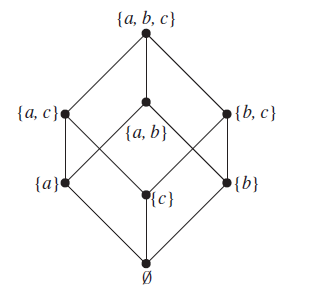

```{r setup, include=FALSE}
knitr::opts_chunk$set(echo = TRUE)
```

## Introduction

### Odds

Let’s say you and a friend are gambling with a fair 6-sided dice. If it lands on an even number, your friend has to give you 10 dollars, and if it lands on an odd number, you give your friend 10 dollars. On any given dice roll, the probability you win or lose is 50%, so the expected value of the amount of money you would make is 0.5($10)-0.5($10) = $0. So the game is fair, as both players can expect to make no money, even though if one stops at any given time, one player will have more money than the other. 

Now let’s revise that game slightly. If the dice lands on a 1 or 2, your friend has to give you 10 dollars, but if it lands on a 3,4,5, or 6, you have to give your friend 10 dollars. Would you take that bet? The expected value on any given turn would be ⅓($10) - ⅔(10) = $-3.33, so you would be irrational to take it on, and it would not be fair. 

How would one revise this game to make it fair? If the dice lands on a 1 or 2, your friend gave you 20 dollars, but if it lands on a 3,4,5, or 6, you still gave your friend 10 dollars. Then the expected value  ⅓($20) - ⅔(10) = $0 and the game is fair again. 

So if you are a bookmaker, and you give out odds (the payout multiple of a bet), your job would be to calculate the probability of the bet occuring, and offer a multiple on that bet so that any average Joe would think it was fair, but your expected value is slightly positive, and theirs is slightly negative. If you get too greedy, no one will want to play with you. If we played the game of the previous paragraph, I could offer my friend gets 19 and I get 11. If they cannot do arithmetic they may think I was awfully generous, even though I know over the long term I will run them broke. 

For further reference, I would read about Gambler’s ruin and fallacy. 
http://mathworld.wolfram.com/GamblersRuin.html 
https://en.wikipedia.org/wiki/Gambler%27s_fallacy 

### Backing and Laying 

https://www.gamblingsites.com/sports-betting/types/exchange/

To quote from gamblingsites.com, “backing a selection is betting that it will happen” and “laying a selection is betting that it will not happen”. It is clear that there are more things that cannot happen than that can happen, and so their respective odds reflect this. When considering horse racing, to count the size of an events that could occur, note you can either place a bet or not and you can bet whether the event will occur or not. So there is at least $4^n$ events that could occur, which is large, but certainly not infinite. To visualize this space, recall Kolmogrov’s observation that the space of events is a -algebra and that probability is a measure, so the number of events that could occur is the same as the vertices of a generalized hypercube. More sophisticated and accurate counting of events would require Polya-Redfield Enumeration. 

https://en.wikipedia.org/wiki/Hypercube 
https://en.wikipedia.org/wiki/Antichain 
https://en.wikipedia.org/wiki/Pólya_enumeration_theorem

### Example




Let’s say you are betting on events A, B, and C, and you want to look at the space of events that could occur. Then you could take as vertices the Power Set of A,B, and C, adjoining vertices X and Y if X is a subset of Y.

Then the probability that the event B will not occur, would be the set of vertices that do not contain B, or 3/7, (not including the empty event). 

## Data Cleaning
```{r Data Load}
library(readxl)
HorseData <- read_excel("~/Desktop/MT5763/Project1/HorseData.xlsx")
```
Number of competitors - 33

```{r}
unique(HorseData$competitor)
```


```{r}
sorted_data <- HorseData[order(HorseData$competitor, HorseData$time),]
```

The following four competitors were randomly chosen. For ease of data replication, the extracted datasets were exported to CSV. 
```{r output=FALSE}
competitor1<-sorted_data[which(sorted_data$competitor==8692300), ]
write.csv(competitor1,"./competitor1.csv", row.names=FALSE)
competitor2<-sorted_data[which(sorted_data$competitor==11538828), ]
write.csv(competitor2,"./competitor2.csv", row.names=FALSE)
competitor3<-sorted_data[which(sorted_data$competitor==9977366), ]
write.csv(competitor3,"./competitor3.csv", row.names=FALSE)
competitor4<-sorted_data[which(sorted_data$competitor==10339376), ]
write.csv(competitor4,"./competitor4.csv", row.names=FALSE)
plot(competitor1$time,competitor1$backPrice1)
plot(competitor1$time,competitor1$backVolume1)
plot(competitor2$time,competitor2$backPrice1)
plot(competitor2$time,competitor2$backVolume1)
plot(competitor3$time,competitor3$backPrice1)
plot(competitor3$time,competitor3$backVolume1)
plot(competitor4$time,competitor4$backPrice1)
plot(competitor4$time,competitor4$backVolume1)
```

```{r}
plot(competitor1$time,competitor1$layPrice1)
plot(competitor1$time,competitor1$layVolume1)
plot(competitor2$time,competitor2$layPrice1)
plot(competitor2$time,competitor2$layVolume1)
plot(competitor3$time,competitor3$layPrice1)
plot(competitor3$time,competitor3$layVolume1)
plot(competitor4$time,competitor4$layPrice1)
plot(competitor4$time,competitor4$layVolume1)
```


## How much money could you have made?

You can also embed plots, for example:

```{r pressure, echo=FALSE}
plot(pressure)
```

## Variance and Expectation Analysis 

## Conclusions